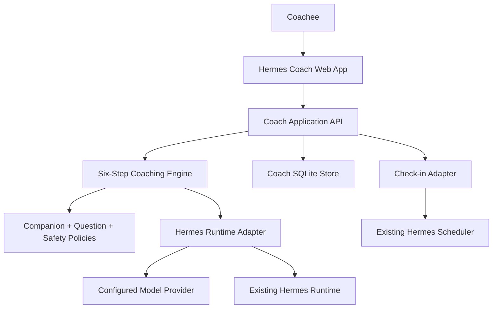

# Hermes Coach System Architecture

## Overview

Tài liệu này là kiến trúc dẫn xuất từ [Hermes Coach Product Proposal](./hermes-coach-product-proposal.md), không phải nguồn yêu cầu độc lập. Proposal luôn được ưu tiên khi có xung đột.

Mục tiêu kiến trúc:

- Web app độc lập, responsive, local-first, một người dùng.
- Domain coaching và dữ liệu có ranh giới riêng.
- Dùng Hermes làm runtime phía backend qua adapter.
- Không fork sâu Hermes core và không thêm Coach-specific core model tool.
- Giữ system prompt byte-stable trong toàn bộ coaching session.
- Mọi component và file đều truy ngược được về source block trong [ma trận truy vết](./hermes-coach-requirements-traceability.md).

Trạng thái tài liệu: `Phase 3 local data verified` từ proposal đã được phê duyệt ngày 2026-08-11. Contract/eval Phase 1 và pure domain/policy/application engine Phase 2 đã đạt exit gate ngày 2026-08-22; xem [báo cáo kiểm chứng Phase 2](../plans/260811-1454-hermes-coach-mvp-implementation/reports/phase-02-verification.md). Phase 3 đã đạt exit gate ngày 2026-08-22 với 7/7 tiêu chí: SQLite schema, migration runner, connection lifecycle, repository active scope, durable confirmation, consent, retention clock, vòng đời Thùng rác, context selector, egress audit, export và restart recovery (`552` test pass qua `35` file chạy cách ly từng process, branch coverage `93%`, ruff và ty sạch); xem [báo cáo kiểm chứng Phase 3](../plans/260811-1454-hermes-coach-mvp-implementation/reports/phase-03-verification.md). HTTP, React, scheduler và provider adapter thuộc các phase sau. Blocker còn lại chỉ áp dụng cho safety/provider evidence và các production/release path bị ảnh hưởng.

## Requirement Ownership

| Requirement family | Architecture owner |
|---|---|
| `HC-GOV` | Source-of-truth governance và traceability |
| `HC-PRODUCT` | Product boundary, scope và deployment topology |
| `HC-COMPANION` | Companion, listening, feedback và question policies |
| `HC-PROCESS` | Six-step engine và state machine |
| `HC-GOAL` | SMART, ownership, benefit/loss và influence gates |
| `HC-OPTIONS` | Option novelty, stuck detection và decomposition |
| `HC-RECORDS` | Confirmation, goals, commitments, evidence và insights |
| `HC-MEMORY` | Structured truth, approved memory và transcript |
| `HC-UX` | Onboarding, Today, Coach, Goals, Journey, Insights, Settings |
| `HC-CHECKIN` | Scheduler, check-in và notification privacy |
| `HC-VOICE` | Deferred capability; không có STT/TTS/voice surface trong MVP hiện tại |
| `HC-PRIVACY` | Local storage, retention, cảnh báo không mã hóa, egress, export và vòng đời Thùng rác |
| `HC-SAFETY` | Role boundaries, safety states và interruption |
| `HC-EVAL` | Golden conversations, evaluations, tests và metrics |

Các family chi tiết trong ma trận như `HC-PROCESS-PRE`, `HC-PROCESS-REALITY`,
`HC-PROCESS-WILL`, `HC-PROCESS-REVIEW`, `HC-DATA-*`, `HC-NFR`, `HC-METRICS`,
`HC-ROADMAP`, `HC-ADR`, `HC-ASSUMPTION`, `HC-DECISION`, `HC-REFERENCE`,
`HC-AC` và `HC-BLOCKER` kế thừa owner của family cha hoặc mục kiến trúc được
chỉ rõ trong heading coverage index. Không được hiểu chúng là yêu cầu không có
owner chỉ vì không có hàng riêng trong bảng tóm tắt này.

## Phase 1 Contract and Evaluation Evidence

The following mappings are verified against the current repository. They describe
contract/evaluation ownership only; the production owners shown elsewhere remain
planned until their later phase is implemented.

| Proposal/source family | Architecture owner | Actual Phase 1 file | Responsibility/content | Test/eval evidence |
|---|---|---|---|---|
| `SRC-031…SRC-061`, `HC-PROCESS` | Six-Step Engine and State Machine | `hermes_coach/contracts/transition_contract.py` | Ordered stages, explicit-Yes gates, Goal predicates, rollback invalidation, no forward skip, readiness reset | `tests/hermes_coach/contract/test_runtime_capability.py` |
| `SRC-061`, `HC-PROCESS`, `HC-DATA-GOAL`, `HC-CHECKIN`, `HC-SAFETY` | Lifecycle and recovery contract | `hermes_coach/contracts/lifecycle_contract.py` | Pause/resume/early close, abandoned-goal reuse, 14-day check-in recovery, retention 90/30, urgent interruption and no silent de-escalation | `tests/hermes_coach/contract/test_lifecycle_contracts.py` |
| `SRC-073…SRC-075`, `HC-COMPANION` | Prompt, cache and structured output seam | `hermes_coach/contracts/runtime_contract.py` | Singular question schema, stable prompt fingerprint, no-tool capability, bounded validated result/failure DTOs | `tests/hermes_coach/contract/test_runtime_capability.py`; `tests/hermes_coach/evals/runtime_harness.py` |
| `SRC-093…SRC-094`, `HC-EVAL` | Evaluation and Verification | `hermes_coach/contracts/evaluation_result.py`; `tests/hermes_coach/evals/scoring.py` | Scenario observations, rubric scores, structural failures and reproducible report scoring | `tests/hermes_coach/evals/test_eval_harness.py` |
| `SRC-026`, `SRC-091`, `HC-PRIVACY` | Privacy, Security and Egress | `hermes_coach/contracts/egress_contract.py` | Egress categories/disclosure, UI consent authority, one-turn authorization and atomic provider-call admission | `tests/hermes_coach/contract/test_runtime_capability.py`; `tests/hermes_coach/contract/test_lifecycle_contracts.py` |
| `SRC-087…SRC-090`, `HC-SAFETY` | Safety Architecture | `hermes_coach/contracts/lifecycle_contract.py` | Contract-level urgent interruption and explicit new Pre-Coaching path | `tests/hermes_coach/contract/test_lifecycle_contracts.py`; safety scenarios |
| `SRC-093`, `HC-EVAL` | Evaluation and Verification | `tests/hermes_coach/evals/external-gates.yaml` | Named pending human safety, provider-retention and provider-capability evidence gates | `tests/hermes_coach/evals/test_eval_harness.py` |

Current verified Phase 1 evidence: exactly `112` SRC, `58` AC and `33` P/T
bundles; `68` scenarios and `7` rubrics; `48` tests pass; last bounded reviewer
`PASS`; Ruff và ty pass; line coverage `91%`. Chi tiết được ghi trong báo cáo xác minh Phase 1. Không
có external safety hoặc provider gate nào được coi là hoàn tất.

## Phase 2 Coaching Engine Evidence

Implementation Phase 2 materializes the proposal's coaching behavior as pure,
provider-neutral Python. Proposal roadmap calls this “Phase 1 — Coaching
Engine”; the implementation plan calls it Phase 2 because contract/evaluation
work was deliberately completed first. There is still exactly one six-step
framework.

| Architecture owner | Production files | Implemented content | Verification |
|---|---|---|---|
| Domain Model; Six-Step Engine | `hermes_coach/domain/{enums,models,session_state,transitions}.py` | Immutable six-step snapshots, exact revision vector, append-only alternating turn ledger with exact content, strict adjacent explicit-Yes gates, downstream revision invalidation, no forward skip and targeted rollback/replay | `tests/hermes_coach/unit/test_transitions.py`; `test_stage_completion.py`; adversarial gate tests |
| Goal Validation | `hermes_coach/domain/goal_rules.py`; `application/coaching_service.py`; `prompt/structured_context.py` | Independent SMART, ownership/fit, influence, benefit/loss and success-evidence predicates before Goal close | `test_goal_rules.py`; Goal scenarios |
| Options Novelty and Recovery | `hermes_coach/domain/options_rules.py`; `policies/question_policy.py` | Per-candidate assessment links baseline, normalized mechanism, Coachee provenance and explicit material-difference confirmation; modifier/reorder/subset mechanisms remain equivalent; canonical recovery and eight-layer decomposition | `test_options_rules.py`; Options scenarios |
| Companion/Listening/Feedback | `hermes_coach/policies/{companion,listening,question,feedback}_policy.py`; `prompt/system_prompt.py` | Equal stance, capacity belief, hypothesis-only barriers, concern/influence, L1–L4 listening, acknowledgment and feedback in question form | four policy test modules; behavior scenarios |
| Prompt and Structured Output | `hermes_coach/prompt/{system_prompt,structured_context,output_schema,question_validator,regeneration}.py` | Byte-stable system prompt, deterministic dynamic context, singular question schema, structural no-advice validation, grounded Coachee phrase evidence for reflection/feedback, bounded fail-closed regeneration and revalidation before sink | prompt contract, validator and regeneration unit tests |
| Confirmation and Check-in Boundary | `hermes_coach/application/record_confirmation_service.py` | Backend-issued short-lived opaque intent binds local user, session, one candidate, action and edited-payload digest; process-local atomic consume/replay guard; no natural-language/batch path; durable CAS explicitly deferred to Phase 3 | `test_record_confirmation.py`; `test_record_confirmation_service.py` |
| Safety | `hermes_coach/domain/enums.py`; `policies/safety_policy.py`; `application/safety_service.py` | Four safety states, prohibited behavior and interruption at validation/staging/delivery; urgent guidance requires signed immutable attestation bound to trusted issuer, evidence/guidance digest, version and validity; no verifier configured by default | `test_safety_policy.py`; safety scenarios; pending external gates |
| Machine governance/evaluation | `hermes_coach/requirements_map.yaml`; `tests/hermes_coach/evals/pure_engine.py` | Exact Phase 2 source/AC/file lists; input/category-driven structural harness calls real coaching, transition, novelty, fail-closed safety routing and validation paths without reading/copying expected output; only observable Phase 2 rubrics are applied | requirements/eval coverage tests; structural-field mutation, anti-oracle and deliberately-broken-implementation tests in `test_phase2_engine.py` |

The exact implementation allocation is machine-owned by
`requirements_map.yaml.phase_2`: 74 source blocks, 52 acceptance criteria, seven
production bundles, seven verification bundles, 19 production files and 22
verification files. Per-AC entries that also require React, SQLite, HTTP,
scheduler or real-provider evidence remain only partially complete until their
own phase closes.

Current verified Phase 2 evidence (2026-08-22): `301` tests pass at the Phase 2
exit gate; branch coverage `91%` over `hermes_coach`; Ruff pass. The `ty`
protocol-variance diagnostics recorded in the verification report were fixed the
same day, so `ty` is clean. Per-file isolation was later confirmed: with a venv
provisioned, `scripts/run_tests_parallel.py` runs all `27` Hermes Coach files in
separate processes and reports `382` passed. `scripts/run_tests.sh` itself stays
unusable on Windows because it assumes the POSIX `bin/` venv layout. Không có
external safety hoặc provider gate nào được coi là hoàn tất.

## Phase 3 Local Data Evidence

Phase 3 is in progress. Two of seven tests-first steps have landed; the machine
scope lives in `requirements_map.yaml.phase_3`, which carries an explicit
`status: in-progress` so a partial phase cannot read as finished evidence.

| Architecture owner | Production files | Implemented content | Verification |
|---|---|---|---|
| Domain Model; Privacy | `hermes_coach/infrastructure/sqlite/migrations/0001_initial_schema.sql` | 16 canonical tables with exact proposal field sets, closed enum CHECKs, foreign keys, confirmed-memory `expires_at IS NULL` invariant, manual-only null provenance source, one open Trash entry per entity, and retention/active-scope indexes | `tests/hermes_coach/persistence/test_sqlite_schema.py` |
| Domain Model | `hermes_coach/infrastructure/sqlite/migration_runner.py`, `migrations/__init__.py` | Immutable versioned plan parsed from the migration directory; DDL, postcondition and version advance inside one `BEGIN IMMEDIATE`; rollback of data and version together; refusal to downgrade a database written by a newer build | `tests/hermes_coach/persistence/test_migrations.py` |
| Privacy, Security and Egress | `hermes_coach/infrastructure/sqlite/database.py` | Caller-owned transactions under an immediate write lock, `foreign_keys`/`busy_timeout`/`synchronous=FULL`/`secure_delete` pragmas, WAL with tested fallback for filesystems that refuse or ignore it, idempotent checkpointing close | `tests/hermes_coach/persistence/test_database_connection.py` |

| Domain Model; Records; Memory | `hermes_coach/domain/records.py`; `hermes_coach/infrastructure/repositories/*.py` | Persisted product records kept separate from live session snapshots; one shared active scope excluding un-restored Trash entries and passed expiries; goal/message/candidate/memory reads additionally filter unconfirmed, resolved and soft-deleted rows; append-only career snapshots exposing no mutation method; append-only multi-source memory provenance; Trash as the only deletion marker, with restore, purge-marking and due-purge queries | `tests/hermes_coach/persistence/test_active_scope.py` |

The test directory is `persistence/`, not `integration/`: the canonical runner
drops any path containing an `integration` component from discovery and from CI
slice generation, which silently hid these files until they were renamed.

| Application Services; Confirmation | `hermes_coach/application/durable_confirmation_service.py`; `infrastructure/repositories/confirmation_repository.py`; `migrations/0002_confirmation_internals.sql` | Intent verification, command replay guard, candidate compare-and-set and the official record write in one `BEGIN IMMEDIATE`; intents stored as SHA-256 digests with at most one live per candidate; accept/edit materialize goal, insight, commitment or memory (memory with provenance and no expiry), discard writes none; re-confirmation appends a revision instead of rewriting provenance; audit holds ids, actions and timestamps only | `tests/hermes_coach/persistence/test_durable_confirmation.py` |
| Privacy, Security and Egress | `hermes_coach/application/consent_service.py`; `infrastructure/repositories/consent_repository.py` | Append-only consent evidence requiring a trusted UI control id, `source` pinned to `ui` by the schema, decision derived from the UI action, type/scope normalized before comparison, latest event wins, and `require_granted` re-reads on every call so a withdrawal blocks the next scoped write or egress | `tests/hermes_coach/persistence/test_consent.py` |

This closes the Phase 2 deferral: `RecordConfirmationAuthority` remains the pure
in-process authority, and the durable service reuses its command shape and
payload digest rather than re-deriving them.

| Privacy, Security and Egress | `hermes_coach/application/retention_service.py`; `trash_service.py`; `domain/clock.py`; `migrations/0003_retention_internals.sql` | Temporary data purged at 90 days and open Trash at 30, on an injected clock, idempotent and catching deadlines missed while the app was closed; a NULL `expires_at` falls back to creation age so no writer can create immortal transcript; durable records never expire by age; soft delete commits with its Trash marker, restore is per item and refuses a missing parent, permanent purge needs a confirmed UI control, removes dependents in order, detaches records that outlive the parent, and writes payload-free audit evidence | `tests/hermes_coach/persistence/test_retention.py`; `test_trash_lifecycle.py` |

Two atomicity scopes in the sweep, deliberately: temporary-data classes share one
transaction so that deadline is never half-enforced, and each due Trash entity
gets its own so its dependents and audit row commit together without holding a
write lock across every purge.

| Privacy, Security and Egress; Memory | `hermes_coach/application/context_selector.py`; `export_service.py`; `infrastructure/egress_audit.py`; `migrations/0004_egress_audit.sql` | Selection applies two independent filters — the repository active scope plus a freshly read consent decision per scope — and returns the active goal, that goal's insights, this session's live transcript and approved memory with provenance, as content-free `EgressItemRef`s; the audit persists the Phase 1 `EgressManifest` into a schema with no content column, keeps provider-retention display metadata versioned separately, and records the allow/block decision; export carries provenance, status, timestamps, consent history and the unencrypted-at-rest disclosure, redacting credential-shaped values | `tests/hermes_coach/persistence/test_context_selection.py`; `test_egress_and_export.py` |

Egress audit reuses the Phase 1 `EgressManifest` rather than defining a second
shape. "The audit holds no payload" is a property of the schema — there is no
content column to fill — not a rule a caller has to remember.

| Six-Step Engine; Domain Model; Check-in | `hermes_coach/application/session_recovery_service.py`; `infrastructure/repositories/{coaching_session,gate,check_in}_repository.py` | Recovery is a read, not a repair: confirmed records, append-only gate history, current stage, provenance and pending check-ins are rebuilt from committed rows through the same repositories the live app uses, so an uncommitted turn never returns and a deletion stays made. A step counts as open only when its highest-revision gate event is a `yes`, which is what makes rollback-then-replay reconstruct correctly. Recovery hands the state back and stops — the proposal requires an explicit non-automatic resume | `tests/hermes_coach/persistence/test_restart_recovery.py` |

Restart recovery is verified against a genuine child interpreter rather than a
reopened connection in one process, including a child killed with `os._exit`
before any clean shutdown. That is what distinguishes durable state from state
that merely survives closing a handle.
`secure_delete` is hygiene, not encryption: the MVP store stays unencrypted at
rest and the product discloses that.

## System Context and Trust Boundaries



Ranh giới dữ liệu:

1. `Coach SQLite Store` là nguồn dữ liệu chuẩn cho profile, career snapshot, goal, commitment, evidence, check-in, session, insight, memory và transcript của Hermes Coach.
2. Hermes session store chỉ phục vụ runtime hội thoại và transport; không thay thế Coach structured truth.
3. Browser giữ presentation state và dữ liệu tạm thời tối thiểu; không dùng IndexedDB làm nguồn chân lý cho Coach domain.
4. Chỉ context đã được chọn và thể hiện trong egress manifest mới đi qua ranh giới model provider.
5. API chỉ listen trên loopback; không có LAN/remote ingress và không có login trong MVP một người dùng.

Retention local đã chốt: mọi structured/domain record không phải dữ liệu tạm giữ tới khi Coachee tự xóa; pending candidate, transcript/session message, technical log và notification history tự xóa vĩnh viễn sau 90 ngày; Thùng rác purge sau 30 ngày. MVP không mã hóa Coach SQLite, attachment hoặc backup at rest và phải cảnh báo rõ trong UI. Topology/authentication đã chốt là loopback-only, không login. Provider-side retention phụ thuộc provider được cấu hình và phải hiển thị trong thông tin egress/provider, không được suy ra là bằng chính sách retention local.

## Planned Repository Layout

Các đường dẫn dưới đây là repository target. Phase 2 paths listed in the
evidence table above now exist; infrastructure, API, React and remaining
application paths are still planned.

```text
hermes_coach/
├── __init__.py
├── bootstrap.py
├── config.py
├── domain/
│   ├── enums.py
│   ├── models.py
│   ├── consent.py
│   ├── session_state.py
│   ├── transitions.py
│   ├── goal_rules.py
│   └── options_rules.py
├── policies/
│   ├── companion_policy.py
│   ├── listening_policy.py
│   ├── question_policy.py
│   ├── feedback_policy.py
│   └── safety_policy.py
├── application/
│   ├── onboarding_service.py
│   ├── coaching_service.py
│   ├── record_confirmation_service.py
│   ├── context_selector.py
│   ├── check_in_service.py
│   ├── privacy_service.py
│   ├── retention_service.py
│   ├── trash_service.py
│   └── safety_service.py
├── prompt/
│   ├── system_prompt.py
│   ├── structured_context.py
│   ├── output_schema.py
│   ├── question_validator.py
│   └── regeneration.py
├── infrastructure/
│   ├── hermes_runtime_adapter.py
│   ├── scheduler_adapter.py
│   ├── egress_audit.py
│   ├── sqlite/
│   │   ├── database.py
│   │   ├── schema.sql
│   │   └── migrations/
│   └── repositories/
│       ├── profile_repository.py
│       ├── goal_repository.py
│       ├── commitment_repository.py
│       ├── session_repository.py
│       ├── memory_repository.py
│       └── trash_repository.py
└── api/
    ├── app.py
    ├── rpc.py
    └── routes/
        ├── onboarding.py
        ├── sessions.py
        ├── goals.py
        ├── commitments.py
        ├── check_ins.py
        ├── privacy.py
        └── notifications.py

apps/hermes-coach/
├── package.json
├── vite.config.ts
└── src/
    ├── main.tsx
    ├── app/
    │   ├── shell.tsx
    │   └── routes.tsx
    ├── features/
    │   ├── onboarding/
    │   ├── today/
    │   ├── coach/
    │   ├── goals/
    │   ├── journey/
    │   ├── insights/
    │   ├── settings/
    │   ├── check-ins/
    │   └── privacy/
    ├── store/
    │   ├── session.ts
    │   ├── profile.ts
    │   └── notifications.ts
    ├── lib/
    │   ├── coach-api.ts
    │   └── gateway-client.ts
    └── service-worker.ts

tests/hermes_coach/
├── unit/
├── contract/
├── integration/
├── e2e/
└── evals/
    ├── scenarios/
    ├── golden_conversations/
    ├── counterexamples/
    └── rubrics/
```

## Existing Hermes Integration Boundary

### Reuse through adapters

| Existing Hermes surface | Use in Coach | Rule |
|---|---|---|
| `run_agent.py` / `AIAgent` | Model/provider runtime | Chỉ gọi qua `hermes_runtime_adapter.py` |
| `agent/conversation_loop.py` | Conversation lifecycle | Không chèn synthetic message giữa loop |
| `agent/system_prompt.py` | Prompt assembly/cache invariant | Không sửa prompt giữa phiên |
| `agent/prompt_builder.py` | Runtime prompt patterns | Không biến Hermes general prompt thành Coach source of truth |
| `agent/memory_manager.py` | Optional approved-memory adapter | Coach SQLite vẫn là structured truth |
| `tui_gateway/ws.py`, `tui_gateway/server.py` | JSON-RPC/WebSocket patterns | UI không gọi `AIAgent` trực tiếp |
| `apps/shared/src/json-rpc-gateway.ts` | Shared browser transport | Dùng qua `gateway-client.ts` khi phù hợp |
| `cron/jobs.py`, `cron/scheduler.py` | Check-in scheduling | Không ghi trực tiếp `jobs.json` |
| `hermes_cli/web_server.py` | Local server patterns | Chỉ bind loopback; không dùng PTY chat page làm Coach UX |

### Core files not owned by Coach

Không sửa đặc thù Coach trong:

- `run_agent.py`
- `agent/conversation_loop.py`
- `agent/system_prompt.py`
- `model_tools.py`
- `toolsets.py`
- `web/src/pages/ChatPage.tsx`

Nếu adapter cần capability còn thiếu, phải thiết kế generic extension surface và ADR riêng; không special-case Coach trong core.

## Domain Model

Owner: `hermes_coach/domain/models.py`, `hermes_coach/infrastructure/sqlite/schema.sql` và repositories.

Các entity bắt buộc từ proposal:

- `coachee_profile`: toàn bộ `id`, `display_name`, `timezone`, `preferred_language`, `challenge_level`, `quiet_hours`, `created_at`, `updated_at`.
- `career_snapshot`: toàn bộ field đã liệt kê và append-only.
- `goal`: toàn bộ field đã liệt kê; lifecycle `draft → active → paused → achieved` và nhánh `abandoned`.
- `commitment`, `evidence`, `check_in`, `coaching_session`, `insight`, `memory_item`: toàn bộ field đã liệt kê trong proposal.
- `coachee_value`, `session_message`, `candidate_record`, `gate_confirmation`, `consent_event` và `trash_entry`: toàn bộ schema chuẩn tắc mới trong proposal.
- Quan hệ profile–snapshot/value/goal/consent/trash, goal–commitment, commitment–check-in/evidence, session–message/candidate/gate/insight/commitment phải được giữ.
- `gate_confirmation` lưu mọi kết quả `yes`, `no`, `unclear`, `invalidated`; chỉ `yes` hợp lệ bật gate, rollback tạo revision và invalidation events.
- `candidate_record` là staging data, không phải structured truth chính thức; xác nhận riêng tại điểm phù hợp và có thể xác nhận lại từng record trong Review/cuối phiên, không batch-confirm.
- `memory_provenance` sở hữu quan hệ đa nguồn của memory; `memory_item` không chứa trực tiếp `source_type`/`source_id`.
- `memory_item.expires_at` là nullable và luôn `NULL` trong MVP sau khi record được xác nhận. Confirmed memory không bị retention service purge theo thời gian, chỉ đi vào Thùng rác khi Coachee chủ động xóa; pending candidate loại `memory` vẫn purge sau 90 ngày và Thùng rác vẫn purge sau 30 ngày.
- `trash_entry` tham chiếu entity bị soft-delete; active queries và context selection luôn loại entity này. Soft delete và tạo trash entry phải atomic; restore riêng từng entity và permanent purge có xác nhận phải ghi audit không chứa payload đã purge.
- `trash_entry.purge_after = deleted_at + 30 ngày`; restore trước mốc này hủy lịch purge của entry đó.
- `retention_service.py` giữ mọi structured/domain record không phải dữ liệu tạm tới khi Coachee tự xóa, gồm profile, snapshot, value, consent/gate/session metadata, confirmed record, evidence và check-in; service tự xóa vĩnh viễn pending candidate/session message/technical log/notification history khi đủ 90 ngày. Automatic retention purge là lifecycle job riêng, không tạo Thùng rác 30 ngày mới.

Phase 1 đã chốt và kiểm thử contract cho lifecycle/data semantics; đây chưa phải production persistence:

- `hermes_coach/contracts/lifecycle_contract.py` định nghĩa pause/resume/early-close, abandoned-goal reuse, check-in recovery, retention và safety transition.
- `hermes_coach/contracts/egress_contract.py` định nghĩa manifest disclosure, UI-bound consent, one-turn `EgressAuthorization` và atomic `provider_call_lease`.
- Pure production domain snapshots/enums and the coaching state engine now exist in Phase 2; persistence entities, repositories, lifecycle jobs and audit storage remain Phase 3/4/6/7 work.

## Six-Step Engine and State Machine

Owner:

- `hermes_coach/domain/session_state.py`
- `hermes_coach/domain/transitions.py`
- `hermes_coach/application/coaching_service.py`
- `tests/hermes_coach/unit/test_transitions.py`
- `tests/hermes_coach/persistence/test_session_recovery.py`
- Phase 1 contract evidence: `hermes_coach/contracts/transition_contract.py`, `hermes_coach/contracts/lifecycle_contract.py`, `tests/hermes_coach/contract/test_lifecycle_contracts.py`, `tests/hermes_coach/contract/test_runtime_capability.py`

Engine phải thực hiện:

- `Pre-Coaching → Goal → Reality → Options → Will → Review`.
- Đây là framework coaching duy nhất; prompt, state machine, UI và runtime không có dispatcher hoặc nhánh cho framework phụ.
- Lưu `current_step`, `step_history` và trạng thái gate.
- Mỗi bước kết thúc bằng đúng một câu chốt Yes/No.
- Gate classifier chỉ chạy cho response ngay sau câu hỏi chốt Pre-Coaching/G/R/O/W/Review.
- Chỉ `Yes` rõ ràng mới chuyển bước; `No`, `unclear`, có điều kiện hoặc mâu thuẫn giữ session ở bước hiện tại để làm rõ.
- Từ bất kỳ current step nào, kể cả Review, Coach có thể rollback trực tiếp tới bất kỳ G/R/O/W step cần xác nhận lại.
- Rollback invalidates gate của bước đích và mọi gate phía sau, tạo revision mới, rồi đi lại đúng thứ tự từ bước đích; không được nhảy về vị trí cũ.
- Cấm mọi forward skip, gồm `Goal → Options`, `Reality → Will` và rollback xong nhảy trực tiếp về origin.
- Goal chỉ bắt đầu khi `pre_coaching_confirmed`; Review chỉ bắt đầu khi bốn gate G/R/O/W đã được xác nhận; session chỉ đóng khi `review_confirmed`.
- Cho pause, early close, safety interruption và phiên khám phá không có commitment.
- `reality_confirmed` cần Reality đủ rõ và explicit Yes sau câu hỏi chốt Reality.
- `will_confirmed` cần action, start time, completion evidence, commitment `1–10` đủ rõ và explicit Yes sau câu hỏi chốt Will.
- `pre_coaching_confirmed` và `review_confirmed` chỉ bật sau explicit Yes cho closing question tương ứng và đủ state của bước.

Pause/resume semantics are resolved at contract level: pause preserves stage/gates and leaves `ended_at` empty; resume preserves them and asks exactly one readiness/current-stage question; early close requires `ended_at` and cannot synthesize gates/records. Production session persistence/recovery remains planned.

Consent ngoài sáu gate không dùng natural-language classifier. `consent_event` chỉ được tạo từ UI action `Xác nhận`, `Từ chối` hoặc `Rút consent`; withdrawal chặn request/write mới trong scope ngay lập tức, còn xóa dữ liệu cũ là thao tác riêng theo vòng đời Thùng rác.

## Goal Validation

Owner:

- `hermes_coach/domain/goal_rules.py`
- `hermes_coach/application/coaching_service.py`
- `hermes_coach/prompt/structured_context.py`
- `tests/hermes_coach/unit/test_goal_rules.py`
- `tests/hermes_coach/evals/scenarios/goal-*.yaml`

Gate Goal phải đồng thời chứng minh:

1. Mục tiêu thuộc về Coachee và phù hợp giá trị/nhu cầu.
2. Mục tiêu nằm trong phạm vi Coachee có thể ảnh hưởng.
3. Mục tiêu đạt đủ SMART.
4. Mục tiêu có lợi ích vật chất/tinh thần/cảm xúc hoặc giải quyết tổn thất.
5. Coachee trả lời Yes cho gate.

Coach không được đặt mục tiêu thay, tự kết luận lợi ích hoặc chuyển Reality khi bất kỳ điều kiện nào còn thiếu.

Ownership/value, benefit/loss, influence và năm thành phần SMART phải được làm rõ
và lưu trong state trước câu hỏi chốt Goal. Câu hỏi chốt không cần liệt kê lại
toàn bộ checklist; service chỉ bật `goal_validated`/`goal_smart_complete` khi mọi
điều kiện nền đã đạt và response sau câu hỏi chốt là explicit Yes.

## Companion, Listening, Question and Feedback Policies

Owners:

- `hermes_coach/policies/companion_policy.py`
- `hermes_coach/policies/listening_policy.py`
- `hermes_coach/policies/question_policy.py`
- `hermes_coach/policies/feedback_policy.py`
- `hermes_coach/prompt/system_prompt.py`
- `hermes_coach/prompt/question_validator.py`

Policy phải bao phủ đầy đủ:

- Người đồng hành ngang vị thế; niềm tin bắt buộc vào tiềm năng Coachee.
- Không quyền uy, gây áp lực, tạo tội lỗi, chẩn đoán, gắn nhãn hoặc quyết định thay.
- Rào cản vô thức là hypothesis, không phải kết luận.
- Vòng tròn quan tâm/ảnh hưởng mà không phủ nhận hoàn cảnh hoặc đổ lỗi.
- KISS, trung lập, đúng `current_step`, một trọng tâm, phễu mở → 5W/1H → làm rõ → Yes/No.
- Why → What khi Why mang tính chất vấn.
- Bốn cấp lắng nghe, phản ánh cảm xúc, quyền sửa phản ánh và tỷ lệ tham khảo 80/20. `80/20` là rubric định tính để ưu tiên Coachee nói nhiều hơn, không phải bộ đếm token/câu hoặc hard gate máy móc.
- Ghi nhận ba phần và feedback Quan sát → Phản chiếu → Khám phá.
- Mỗi Coach utterance tạo thành đúng một câu hỏi. Mệnh đề mở đầu được phép lặp/trích dẫn/phản chiếu trung lập lời Coachee nhưng không được đứng riêng và không được thêm kết luận.
- Kỹ thuật đổi góc nhìn, chia nhỏ vấn đề, dùng im lặng và “còn gì nữa không”.
- Toàn bộ câu hỏi mẫu là catalog/evaluation examples, không phải checklist máy móc.

Question-only validator phải đánh giá toàn bộ utterance: cho phép declarative
lead-in có nguồn từ lời Coachee chỉ khi nó nằm trong cùng một câu hỏi và phần
nghi vấn trả quyền diễn giải cho Coachee; chặn standalone statement, advice,
judgment và inferred motive.

## Options Novelty and Stuck Recovery

Owner:

- `hermes_coach/domain/options_rules.py`
- `hermes_coach/application/coaching_service.py`
- `hermes_coach/policies/question_policy.py`
- `tests/hermes_coach/unit/test_options_rules.py`
- `tests/hermes_coach/evals/scenarios/options-*.yaml`

Hệ thống phải giữ baseline của các giải pháp ban đầu, nhận diện lặp/trùng bản chất và không bật `options_confirmed` cho đến khi Coachee tự đưa ra ít nhất một giải pháp mới khác bản chất. Coach không được cung cấp giải pháp để hoàn tất gate.

Khi kẹt, thứ tự playbook là kiểm tra Goal/Reality, rồi đổi cách hỏi/góc nhìn, hỏi thêm, gợi nhớ, im lặng, chia nhỏ và thêm nguồn lực. Không có Research mode hoặc Advice mode; khi Coachee yêu cầu câu trả lời, Coach tiếp tục bằng đúng một câu hỏi thuộc bước hiện tại và không cung cấp giải pháp thay Coachee.

Phase 2 implements machine-readable normalization/classification, material-difference confirmation, Coachee ownership and deterministic stuck/decomposition ordering. Persistence of option records and model-provider integration remain later-phase work.

## Prompt, Cache and Structured Output

Owner:

- `hermes_coach/prompt/system_prompt.py`
- `hermes_coach/prompt/structured_context.py`
- `hermes_coach/prompt/output_schema.py`
- `hermes_coach/prompt/question_validator.py`
- `hermes_coach/prompt/regeneration.py`
- `hermes_coach/infrastructure/hermes_runtime_adapter.py`
- Phase 1 contract/eval seam: `hermes_coach/contracts/runtime_contract.py`, `hermes_coach/contracts/evaluation_result.py`, `tests/hermes_coach/evals/runtime_harness.py`, `tests/hermes_coach/evals/scoring.py`

Stable system prompt chứa identity, belief, equal stance, six-step rules, safety boundary và structured-output contract. Prompt phải byte-stable trong phiên; state động đi qua structured context/service result, không qua system message mới giữa history.

Output schema tối thiểu dùng field bắt buộc `question: string`, `coaching_stage`, candidate arrays,
`goal_smart_status`, `goal_value_status`, `safety_signal`. Candidate records đi
vào confirmation UI, không tự lưu. Không có `questions[]` hoặc output nhiều câu hỏi.

Validator hai tầng:

1. Schema validation.
2. Semantic validation cho mệnh lệnh, lời khuyên trá hình, phán xét, chẩn đoán và vị thế quyền uy.

Output lỗi không được hiển thị; regenerate với reason machine-readable; lỗi lặp lại tạo Product UI error trung tính và retry.

Phase 1 verification proves the provider-neutral buffered path and Phase 2 now supplies the production prompt/schema/validator/regeneration policy. The future `hermes_runtime_adapter.py` remains responsible for provider I/O, usage accounting and the real buffered sink boundary.

## Application Services and Confirmation

UI chỉ gọi application services. Services sở hữu onboarding/consent, session state, goal, commitment, check-in, context selection, confirmation, privacy, safety và interruption.

`record_confirmation_service.py` phải đảm bảo:

- Goal, insight, commitment và memory chỉ thành official record sau xác nhận.
- Coachee có thể sửa, chấp nhận hoặc bỏ candidate record.
- Candidate được trình riêng khi xuất hiện hoặc tại điểm phù hợp gần nhất; Review/cuối phiên chỉ xác nhận/chỉnh lại từng record, không gom toàn bộ candidates.
- Review có thể không sinh insight/commitment.
- Transcript có thể được chuyển vào Thùng rác và bị loại khỏi active context trong khi structured truth đã xác nhận vẫn tồn tại; restore/permanent purge đi qua `trash_service.py`.

Consent ngoài sáu gate dùng UI controls chuẩn và lưu `consent_event`; candidate confirmation không được suy ra từ hội thoại tự nhiên.

## Web UX

Owner: `apps/hermes-coach/src/app/`, `features/` và `store/`.

Routes bắt buộc:

- `Today`
- `Coach`
- `Goals`
- `Journey`
- `Insights`
- `Settings/Coaching agreement`
- `Settings/Notifications`
- `Settings/Model provider`
- `Settings/Privacy and data`

Onboarding, Home, Coaching Session text, Scheduled Check-in và Privacy Center phải triển khai toàn bộ flow, controls và candidate-confirmation behavior trong proposal. Core flow phải dùng được bằng keyboard. UX không dùng general-agent tool palette và không dùng dashboard PTY chat làm primary Coach experience.

## Check-in and Notifications

Owner:

- `hermes_coach/application/check_in_service.py`
- `hermes_coach/infrastructure/scheduler_adapter.py`
- `hermes_coach/api/routes/check_ins.py`
- `hermes_coach/api/routes/notifications.py`
- `apps/hermes-coach/src/features/check-ins/`
- `apps/hermes-coach/src/service-worker.ts`

Check-in theo lịch phải hỏi tiến độ, yếu tố hỗ trợ/cản trở và độ phù hợp của cam kết; cho giữ, sửa, dời hoặc hủy. Notification chỉ dùng copy trung tính, tôn trọng permission và quiet hours, không guilt/streak shame.

Adapter dùng scheduler hiện có qua API/service, không ghi trực tiếp dữ liệu cron.

Phase 1 lifecycle contract resolves the baseline: 14-day default cadence, at most one neutral reminder after 24 hours outside quiet hours, one catch-up, and permission denial disabling browser delivery without hiding due items. Scheduler integration, editable cadence UI and persistence remain planned.

## Voice

Deferred ngoài phạm vi MVP hiện tại. Không có owner/path cho voice service, adapter, API route, frontend store/feature hoặc test; ứng dụng không xin microphone và không thu/lưu audio. Mọi STT/TTS/voice design cần một quyết định proposal mới.

## Privacy, Security and Egress

Owner:

- `hermes_coach/application/privacy_service.py`
- `hermes_coach/application/retention_service.py`
- `hermes_coach/application/trash_service.py`
- `hermes_coach/application/context_selector.py`
- `hermes_coach/infrastructure/egress_audit.py`
- `hermes_coach/api/routes/privacy.py`
- `hermes_coach/infrastructure/repositories/trash_repository.py`
- `apps/hermes-coach/src/features/privacy/`

Yêu cầu:

- Server chỉ bind loopback và không có login; LAN/remote/public bind bị cấm trong MVP.
- SQLite và attachment trong profile riêng.
- Coach SQLite, attachment và backup không được mã hóa at rest trong MVP; không tạo application key, key-store, key rotation hoặc field-encryption layer.
- Local protection dựa vào Windows user-profile access control và quyền filesystem. Onboarding, Privacy Center và trước khi tạo backup phải cảnh báo rằng người dùng hoặc tiến trình có quyền đọc profile/backup có thể đọc dữ liệu coaching.
- Không lưu API key trong coaching database.
- Context minimization theo goal/session hiện tại.
- Egress manifest theo nhóm dữ liệu trước model call; không lưu secret.
- View/edit từng item và export JSON/Markdown.
- Delete theo item/session/goal/all là soft delete: cùng transaction đánh dấu entity và tạo `trash_entry`.
- Entity trong Thùng rác bị loại khỏi active UI, coaching context, model egress, check-in và notification.
- Privacy Center cho xem và restore riêng từng item; permanent purge từng item hoặc toàn bộ Thùng rác cần UI confirmation riêng và xóa payload cùng quan hệ phụ thuộc theo transaction.
- `purge_after` của Thùng rác bằng `deleted_at + 30 ngày`; restore trước hạn hủy lịch purge, còn purge đúng hạn xóa payload và quan hệ phụ thuộc.
- Pending candidate, transcript/session message, technical log và notification history bị permanent purge sau 90 ngày; mọi structured/domain record không phải dữ liệu tạm không tự hết hạn.
- Backup không mã hóa có thể chứa dữ liệu đã hết retention hoặc đã bị purge khỏi active store; UI phải nêu rõ Coachee tự chịu trách nhiệm xóa/thay thế bản backup cũ.
- Provenance và `last_used_at` hiển thị được.
- Restart không mất confirmed records hoặc lịch check-in.

Phase 1 egress contract is implemented: `EgressConsentAuthority` records trusted UI decisions, issues opaque one-turn `EgressAuthorization`, validates manifest/session/turn/scope/version, and holds the provider call inside atomic `provider_call_lease`; withdrawal or a forged/stale authorization fails closed before provider call. Provider retention remains `unknown` until external provider evidence is reviewed. Production egress audit, UI editing/history and persistence remain planned.

## Safety Architecture

Owner:

- `hermes_coach/policies/safety_policy.py`
- `hermes_coach/application/safety_service.py`
- `hermes_coach/domain/enums.py`
- `tests/hermes_coach/unit/test_safety_policy.py`
- `tests/hermes_coach/evals/scenarios/safety-*.yaml`

State: `normal`, `sensitive`, `possible_crisis`, `urgent`.

- `normal`: six-step flow.
- `sensitive`: xin phép trước khi đi sâu.
- `possible_crisis`: dừng coaching và hỏi kiểm tra an toàn.
- `urgent`: rời vai Coach, cho direct safety guidance, không tiếp tục six-step flow.

Safety service phải đứng ngoài question-only validator khi ở `urgent`, nhưng không được biến ngoại lệ này thành advice mode thông thường.

Direct guidance trong `urgent` đã được chấp thuận và UI phải hiển thị rõ hệ thống đã rời vai Coach. Phase 1 contract tests verify interruption, direct guidance, no normal coaching, and no silent de-escalation/auto-resume. Safety detection thresholds, regional support content and release wording remain pending in `tests/hermes_coach/evals/external-gates.yaml`; they block affected safety release work only.

## Evaluation and Verification

Owner: `tests/hermes_coach/`.

Trước UI lớn phải có 50–100 scenarios, golden conversations, counterexamples và question-only rubric. Verification gồm:

- Unit: transitions, Goal hard gate, Options novelty, consent, validator, safety.
- Contract: output schema, API/RPC, prompt byte stability, egress manifest.
- Integration: runtime adapter, SQLite/restart, scheduler, retention 90/30 ngày, cảnh báo dữ liệu không mã hóa và vòng đời soft-delete/restore/permanent-purge.
- E2E: onboarding, text six-step với sáu explicit-Yes gates, candidate confirmation riêng và re-confirm từng record, Privacy Center/Thùng rác, check-in.
- Evaluation: mọi scenario và rubric trong proposal.

Phase 2 executes all `68` corpus inputs through an input/category-driven pure
harness that calls the real coaching service, gate classifier, rollback,
Options novelty, fail-closed safety routing and question validator. It does not
mint synthetic external safety approval. The harness never reads
`scenario.expected`; observation independence is mutation-tested for the whole
expected object, and every structural field independently changes the verdict.
Only rubrics actually observable in the Phase 2 path are selected; later privacy,
memory and check-in behavior is not self-awarded. Free-text `expected.must_do`
and `must_not_do` remain human-readable golden-conversation intent in structural
mode and are never copied or auto-credited; focused policy tests and later
real-provider/human evaluation own language quality.

Metrics không tối ưu số tin nhắn hoặc thời gian sử dụng. Chỉ ghi nhận các metric nguồn đã định nghĩa và không biến chúng thành chấm điểm giá trị con người.

## Delivery and Deployment

Roadmap Phase 0–6 trong proposal là thứ tự chuẩn. Không bắt đầu phase code khi source block tương ứng còn `blocked` hoặc chưa có test target.

Deployment target:

- Local loopback-only package cho Windows; không login và không LAN/remote bind.
- Coach SQLite và app profile riêng.
- Hermes runtime/provider được cấu hình qua adapter.
- Offline/degraded behavior, crash recovery, backup/restore và egress audit ở hardening.

Startup ownership và backup/restore format đã được chốt ở mức contract khi plan
được phê duyệt: một owner `hermes coach`, loopback port khả dụng, ephemeral token,
và backup ZIP không mã hóa gồm manifest/checksum cùng SQLite Backup API snapshot.
Production startup, backup/restore và Windows smoke test vẫn planned cho Phase 4/7.

## Architecture Decision and Blocker Status

| ID | Status | Resolution or remaining decision |
|---|---|---|
| `BLK-01` | `resolved` | Feedback/reflection/acknowledgment là một câu hỏi, có thể có declarative lead-in có căn cứ nhưng không có standalone statement. |
| `BLK-02` | `resolved` | Commitment scale là `1–10`. |
| `BLK-03` | `resolved` | Sáu gate dùng explicit Yes; consent ngoài gate chỉ dùng UI `Xác nhận`/`Từ chối`/`Rút consent`, withdrawal chặn request/write mới. |
| `BLK-04` | `resolved` | Pre-Coaching cần Yes để sang Goal; Review cần Yes để đóng phiên, No/unclear ở lại trừ targeted rollback. |
| `BLK-05` | `resolved` | Rollback tới bất kỳ G/R/O/W cần revalidate, invalidate downstream, rồi đi tuần tự. |
| `BLK-06` | `resolved` | Goal criteria được làm rõ trước closing gate; service kiểm tra toàn bộ state. |
| `BLK-07` | `resolved` | Structured output dùng singular `question: string` bắt buộc. |
| `BLK-08` | `resolved` | Reality/Will chỉ confirmed sau explicit Yes cho closing question và đủ state. |
| `BLK-09` | `resolved` | Proposal đã có schema value, message, candidate, gate, consent và trash entry. |
| `BLK-10` | `resolved` | `memory_provenance` đa nguồn là schema chuẩn; source fields rời `memory_item`. |
| `BLK-11` | `resolved` | Research/Advice mode bị loại khỏi phạm vi hiện tại; Coach tiếp tục question-only. |
| `BLK-12` | `resolved` | Loopback/no-login, delete/Trash, retention 90/30 ngày và MVP không mã hóa at rest đã chốt; UI phải cảnh báo rõ, API key không nằm trong coaching DB. |
| `BLK-13` | `resolved` | Xác nhận riêng candidate tại điểm phù hợp; có thể re-confirm từng record trong Review/cuối phiên, không batch. |
| `BLK-14` | `resolved` | STT/TTS/voice bị hoãn khỏi phạm vi; không cần chọn stack cho MVP text. |
| `BLK-15` | `resolved` | Safety System được direct guidance trong urgent; chi tiết detection/content/resume vẫn là safety-design blocker riêng. |
| `BLK-16` | `resolved` | Pre-Coaching + GROW + Review là framework duy nhất; rollback được phép nhưng mọi forward transition vẫn phải tuần tự. |
| `BLK-17` | `resolved` | Confirmed `memory_item` tồn tại tới khi Coachee tự xóa; `expires_at = NULL`, không automatic expiry; pending memory candidate vẫn 90 ngày và memory trong Thùng rác vẫn 30 ngày. |

Các mục `open`, `partial` và `proposed` phải được giải quyết tại proposal trước
khi code phần bị ảnh hưởng.

## References

- [Hermes Coach Product Proposal](./hermes-coach-product-proposal.md)
- [Hermes Coach Requirements Traceability](./hermes-coach-requirements-traceability.md)
- `AGENTS.md`
- `agent/system_prompt.py`
- `agent/prompt_builder.py`
- `agent/memory_manager.py`
- `hermes_state.py`
- `cron/`
- `tui_gateway/`
- `apps/shared/`
